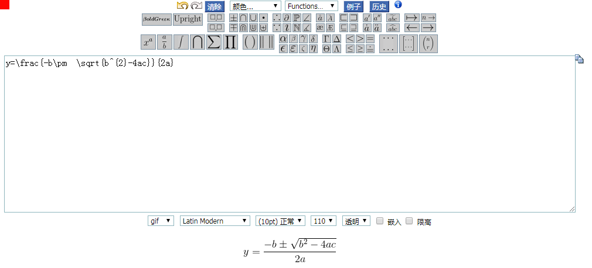

目录

<!-- TOC -->

- [1. 在线编写公式](#在线编写公式)
	
- [2. 借助其他插件显示](#借助其他插件显示)
	- [2.1 借助Google Chart服务器](#2.1)
	- [2.2 借助forkosh服务器](#2.2)
	- [2.3 借助MathJax引擎（强烈推荐）](#2.3)

<!-- /TOC -->

## 1. 在线编写公式

在线网站： [https://www.codecogs.com/latex/eqneditor.php](https://www.codecogs.com/latex/eqneditor.php) 可以在该网站编写公式
公式编写规则： https://www.jianshu.com/p/7c34f5099b7e

<html>
<br/>


<br/>

</html>

## 2. 借助其他插件显示

### 2.1 借助Google Chart服务器

```html

ex：

```

### 2.2 借助forkosh服务器

```html

ex:

```

### 2.3 借助MathJax引擎（强烈推荐）

在markdown头部添加外部js引用
```html
<script type="text/javascript" src="http://cdn.mathjax.org/mathjax/latest/MathJax.js?config=default"></script>
```

在markdown中直接输入公式
- 行间公式 

```
$$公式$$
```

- 行内公式 

```
\\(公式\\)
```
